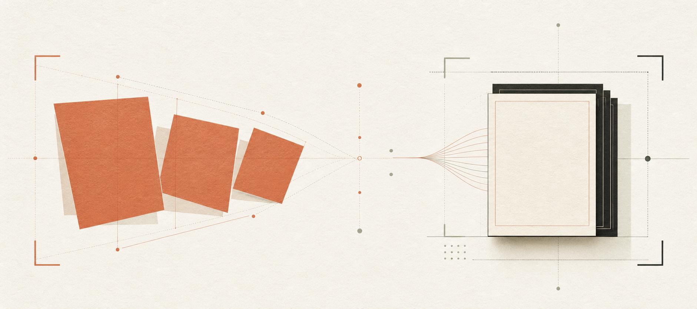

<!-- markdownlint-disable MD013 MD033 MD041 -->

<p align="center">
  
</p>

<h1 align="center">
  
  拾序
</h1>

<p align="center">
  <strong>开源版扫描全能王：把随手拍下的纸张，变成规整、清晰、可归档的电子文档。</strong><br>
  <sub>iPhone · 完全本地处理 · 无账号 · 无后端 · MIT 开源</sub>
</p>

<p align="center">
  <a href="https://github.com/MarkShawn2020/shixu/releases/latest">
    
  </a>
  <a href="LICENSE">
    
  </a>
  
  
</p>

<p align="center">
  <a href="#为什么是拾序">为什么是拾序</a> ·
  <a href="#能做到什么">能做到什么</a> ·
  <a href="#从拍下到归档">处理流程</a> ·
  <a href="#与商业扫描-app-的差异">差异化</a> ·
  <a href="#快速开始">快速开始</a> ·
  <a href="#技术实现">技术实现</a>
</p>

---

## 先看结论

拾序是一款面向 iPhone 的本地文件扫描 App。对准纸张连续拍摄，它会自动寻找四角、拉正透视、改善阴影与对比度，再把多页内容整理成 A4 PDF 或高清图片。

```text
斜拍 / 阴影 / 多页散乱
          ↓
自动锁边 → 透视校正 → 文档增强 → 检查排序 → PDF / JPEG
          ↓
原图、处理结果与扫描历史始终留在本机
```

它不是另一个需要注册、上传和订阅才能工作的文档云服务，而是一条开源、离线、可审计、可自行修改的核心扫描链路。

## 为什么是拾序

手机当然可以直接拍纸张，但“拍到”与“得到一份可以交付的文档”之间，通常还隔着不少工作。

| 随手拍下来的问题 | 拾序的处理 |
| --- | --- |
| 纸张斜着拍，四边变成梯形 | 自动识别四角并做透视校正 |
| 光线不均，纸面发灰或有阴影 | 局部阴影补偿、智能提亮与对比度增强 |
| 页面比例混乱、正文仍有轻微倾斜 | 标准纸张比例归一化，并用文字行二次校准 |
| 一份材料有很多页 | 连续拍摄、后台排队处理、排序、旋转和删除 |
| 拍完后分不清“这一份”和“下一份” | 独立完成态，导出当前文档或直接“再拍一份” |
| 文件涉及合同、证件或内部资料 | 无账号、无后端、无远程上传，全部在设备本地处理 |

适合这些场景：

- 合同、票据、讲义、手写笔记和纸质档案电子化
- 临时需要把多张纸快速合成一份 PDF
- 对隐私敏感，希望文档不经过第三方服务器
- 想研究或定制文档检测、透视校正与本地 PDF 生成链路

## 能做到什么

### 拍得快

- 连续拍摄多页文件，不必每拍一张就停下来等待
- 也可以从相册一次导入最多 20 张图片
- 暗光环境支持常亮手电筒
- 取景时直接分析原生相机视频帧，高置信结果会立即锁定纸张四角

### 自动变规整

- Apple Vision 文档分割与矩形检测双重识别
- 透视几何变换，把斜拍纸张还原为正视页面
- 自动估算安全边距与标准纸张比例
- Vision 文字行二次校准，继续消除正文横向透视
- 彩色、灰度、黑白三种模式，可按页调整
- 自动结果不理想时，可以手动拖动四角重新处理

### 多页也好整理

- 每页拍完立即进入后台处理队列
- 缩略图预览、删除、旋转与重新排序
- 清晰的“扫描完成”状态，把当前文档与下一份扫描分开
- 自动保存本机历史，可重新打开、继续编辑、导出或整份删除

### 导出即可交付

- 原生逐页写入 A4 多页 PDF
- 批量保存高清 JPEG 到系统相册
- 通过系统分享面板发送 PDF 或单页图片
- 可选「手工川工作室」轻量水印，导出前可关闭

## 从拍下到归档

1. **拍摄或导入**：连续拍纸张，或从相册批量选择图片。
2. **自动识别**：实时锁定边缘；拍摄后再用高质量链路复核四角。
3. **校正增强**：拉正透视、统一页面比例、补偿阴影并增强文字。
4. **检查整理**：调整四角、切换滤镜、旋转、删除或重排页面。
5. **完成当前文档**：保存到本机历史，与下一份扫描明确分开。
6. **导出**：生成 A4 PDF，或把每页保存为高清图片。

扫描处理与导出不依赖登录、业务网络请求或服务端任务。

## 与商业扫描 App 的差异

“开源版扫描全能王”描述的是产品方向，并不意味着逐项复刻一套成熟商业办公平台。拾序优先解决的是：**用户能否掌握自己的扫描数据、处理逻辑与运行方式。**

| 维度 | 拾序 | 常见商业扫描产品的方向 |
| --- | --- | --- |
| 核心目标 | 做好从拍摄到导出的本地扫描闭环 | 扫描之外继续扩展云盘、协作和办公服务 |
| 数据路径 | 默认只在本机保存和处理 | 通常强调账号体系、云同步或在线能力 |
| 账号与后端 | 没有账号系统，也没有业务后端 | 服务能力往往与账号或云端绑定 |
| 源代码 | MIT 开源，可审计、修改和自行构建 | 闭源，由产品方决定处理逻辑与边界 |
| 定制空间 | 可替换算法、滤镜、水印、交互和导出链路 | 以应用内提供的选项为准 |
| 当前成熟度 | iOS 优先的早期开源产品，需要 Development Build | 通常拥有成熟的商店分发与跨平台服务 |
| 功能取舍 | 聚焦拍摄、校正、增强、整理、历史与导出 | OCR、签名、团队协作等外围能力通常更丰富 |

拾序不靠功能数量取胜。它选择把最重要的一段能力做得透明：**纸张进入镜头以后发生了什么，用户和开发者都看得见，也改得动。**

> 此项目与“扫描全能王”及其运营主体没有隶属、授权或合作关系。

## 隐私设计

| 阶段 | 数据 | 去向 |
| --- | --- | --- |
| 拍摄 | 相机照片、相册导入图片 | App 本机文档目录 |
| 处理 | 四角、校正图、滤镜结果 | 本机 CPU / GPU 与系统框架 |
| 历史 | 原图、处理图、页面顺序和滤镜设置 | App 本机文档目录 |
| 导出 | PDF 或 JPEG | 系统分享面板、相册或用户选择的位置 |

项目中没有账号系统、分析 SDK、广告 SDK 或远程上传接口。卸载 App 或主动删除历史时，本机对应数据也会随之移除。

## 快速开始

### 环境要求

- macOS
- Node.js 22.13 或更高版本
- Xcode 26.4 或更高版本
- iOS 16.4 或更高版本的 iPhone
- 数据线连接真机完成首次 Development Build

版本基线以 [Expo SDK 57 官方文档](https://docs.expo.dev/versions/v57.0.0/) 为准。

### 首次安装到 iPhone

```bash
git clone git@github.com:MarkShawn2020/shixu.git
cd shixu
npm install
npm run ios -- --device
```

项目包含自定义 Apple Vision / Core Image 原生模块，因此完整扫描增强链路通过 Development Build 运行。构建脚本会把工程同步到纯英文临时目录，再调用 Xcode，以避开 CocoaPods 对中文工程路径的兼容问题。

### 日常开发

Development Build 已安装后，TypeScript 与界面修改只需启动 Metro：

```bash
npm start
```

确保 iPhone 与 Mac 处于同一局域网，然后打开手机上的「拾序」。只有新增或升级原生依赖时，才需要再次执行：

```bash
npm run ios -- --device
```

### 发布产物

[GitHub Releases](https://github.com/MarkShawn2020/shixu/releases) 提供经过 CI 验证的 iOS 静态导出包与 SHA-256 校验文件。静态导出包用于验证和分发 JavaScript / 资源，不是可直接安装的 IPA；当前真机安装仍走上面的 Development Build 流程。

## 技术实现

| 环节 | 实现 |
| --- | --- |
| 应用框架 | Expo SDK 57、React Native 0.86、TypeScript |
| 连续拍摄 | `expo-camera` |
| 实时帧分析 | AVFoundation `AVCaptureVideoDataOutput`，丢弃积压帧并以 100ms 节流 |
| 文档边缘 | Vision `VNDetectDocumentSegmentationRequest` |
| 识别后备 | Vision `VNDetectRectanglesRequest` 与纯 TypeScript 检测链路 |
| 图像校正 | Core Image GPU 透视变换、标准纸张比例与 `CIDocumentEnhancer` |
| 文字校准 | Vision 文字行公共边距分析 |
| PDF | Core Graphics 原生逐页写入，`expo-print` 作为后备 |
| 本机历史 | `expo-file-system` 保存原图、结果图与记录元数据 |
| 导出分享 | `expo-media-library`、`expo-sharing` |

关键目录：

```text
modules/document-vision/   Apple Vision / Core Image / Core Graphics 原生能力
src/components/            拍摄、编辑、完成态、历史与导出界面
src/lib/                   检测、图像处理、历史与导出业务链路
scripts/                   iOS Development Build 与原生补丁脚本
.github/workflows/         Expo 检查与 GitHub Release CI/CD
```

## 当前边界

- 当前重点验证 iPhone 与 iOS 原生增强链路
- 尚未提供 App Store / TestFlight 安装包
- 暂未实现 OCR、可搜索 PDF、电子签名、云同步与团队协作
- Android 与 Web 不是当前生产级目标
- 本项目仍处于 `0.x` 阶段，数据结构与交互可能继续调整

这些边界也是很好的贡献入口：如果你关心 OCR、Android 文档检测、可重复测试样本或更完整的分发方式，欢迎提出 Issue 或 PR。

## 开发与验证

```bash
npm run typecheck
npm run test:detection
npm run doctor
npx expo export --platform ios
```

所有合并到 `main` 的提交都会运行相同的 GitHub Actions 检查。版本发布由 `v*` 标签触发，Release 说明来自 [`CHANGELOG.md`](CHANGELOG.md)。

## 参与贡献

1. Fork 仓库并从 `main` 创建分支。
2. 保持文档处理在设备本地完成。
3. 优先选择 Expo 兼容依赖；引入新原生模块时说明产品收益。
4. 提交前运行完整验证命令。
5. 通过 [Issues](https://github.com/MarkShawn2020/shixu/issues) 描述问题，或直接发起 Pull Request。

如果这个方向对你有帮助，欢迎 Star。它能让更多需要“本地、透明、可改”的扫描工具用户找到拾序。

## Star History

<p align="center">
  <a href="https://github.com/MarkShawn2020/shixu">
    
  </a>
</p>

## 许可证

项目采用 [MIT License](LICENSE)。

封面由 OpenAI 图像生成工具根据拾序的“从斜拍纸张到规整文档”概念生成；项目 Logo 与界面视觉属于拾序品牌资产。
